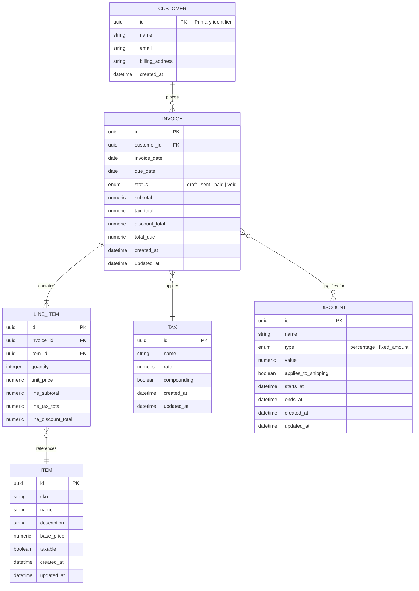

# Billing Data Model

## Overview
This document outlines the initial data model for managing customers, invoices, and related pricing adjustments. It covers entity relationships, database selection, schema definitions, and notes from the first round of stakeholder review.

## Entity Relationship Diagram


## Database Selection
We will prototype and launch on **PostgreSQL**. While SQLite offers a light footprint, the invoicing workload requires concurrency controls, robust indexing options, and advanced features (such as generated columns for totals) that align better with PostgreSQL's production-readiness.

## Table Schemas
The following table definitions are written in PostgreSQL syntax. Monetary values use `NUMERIC(12,2)` to ensure precision and avoid rounding errors. Timestamps use `TIMESTAMPTZ` for consistent timezone handling.

### `customers`
```sql
CREATE TABLE customers (
    id UUID PRIMARY KEY DEFAULT gen_random_uuid(),
    name TEXT NOT NULL,
    email CITEXT UNIQUE NOT NULL,
    billing_address JSONB,
    created_at TIMESTAMPTZ NOT NULL DEFAULT NOW()
);

CREATE INDEX idx_customers_name_trgm ON customers USING GIN (name gin_trgm_ops);
```
- `CITEXT` handles case-insensitive email comparisons.
- Trigram GIN index enables fast partial matching when searching by name.

### `invoices`
```sql
CREATE TYPE invoice_status AS ENUM ('draft', 'sent', 'paid', 'void');

CREATE TABLE invoices (
    id UUID PRIMARY KEY DEFAULT gen_random_uuid(),
    customer_id UUID NOT NULL REFERENCES customers(id) ON DELETE CASCADE,
    invoice_date DATE NOT NULL,
    due_date DATE NOT NULL,
    status invoice_status NOT NULL DEFAULT 'draft',
    subtotal NUMERIC(12,2) NOT NULL DEFAULT 0,
    tax_total NUMERIC(12,2) NOT NULL DEFAULT 0,
    discount_total NUMERIC(12,2) NOT NULL DEFAULT 0,
    total_due NUMERIC(12,2) NOT NULL DEFAULT 0,
    created_at TIMESTAMPTZ NOT NULL DEFAULT NOW(),
    updated_at TIMESTAMPTZ NOT NULL DEFAULT NOW()
);

CREATE INDEX idx_invoices_customer_status ON invoices (customer_id, status);
CREATE INDEX idx_invoices_invoice_date ON invoices (invoice_date DESC);
```
- Composite index accelerates filtering invoices by customer and status.
- Descending index supports listing the newest invoices first.

### `items`
```sql
CREATE TABLE items (
    id UUID PRIMARY KEY DEFAULT gen_random_uuid(),
    sku TEXT UNIQUE NOT NULL,
    name TEXT NOT NULL,
    description TEXT,
    base_price NUMERIC(12,2) NOT NULL,
    taxable BOOLEAN NOT NULL DEFAULT TRUE,
    created_at TIMESTAMPTZ NOT NULL DEFAULT NOW(),
    updated_at TIMESTAMPTZ NOT NULL DEFAULT NOW()
);

CREATE INDEX idx_items_name_trgm ON items USING GIN (name gin_trgm_ops);
```
- `sku` uniqueness ensures no duplicate catalog entries.
- Name trigram index supports fuzzy searches in product selection UIs.

### `taxes`
```sql
CREATE TABLE taxes (
    id UUID PRIMARY KEY DEFAULT gen_random_uuid(),
    name TEXT NOT NULL,
    rate NUMERIC(5,4) NOT NULL CHECK (rate >= 0),
    compounding BOOLEAN NOT NULL DEFAULT FALSE,
    created_at TIMESTAMPTZ NOT NULL DEFAULT NOW(),
    updated_at TIMESTAMPTZ NOT NULL DEFAULT NOW()
);

CREATE UNIQUE INDEX idx_taxes_name ON taxes (name);
```
- `rate` captures values like 0.0825 (8.25%).
- Unique index prevents duplicate tax rules.

### `discounts`
```sql
CREATE TYPE discount_type AS ENUM ('percentage', 'fixed_amount');

CREATE TABLE discounts (
    id UUID PRIMARY KEY DEFAULT gen_random_uuid(),
    name TEXT NOT NULL,
    type discount_type NOT NULL,
    value NUMERIC(12,2) NOT NULL CHECK (
        (type = 'percentage' AND value BETWEEN 0 AND 100)
        OR (type = 'fixed_amount' AND value >= 0)
    ),
    applies_to_shipping BOOLEAN NOT NULL DEFAULT FALSE,
    starts_at TIMESTAMPTZ,
    ends_at TIMESTAMPTZ,
    created_at TIMESTAMPTZ NOT NULL DEFAULT NOW(),
    updated_at TIMESTAMPTZ NOT NULL DEFAULT NOW()
);

CREATE INDEX idx_discounts_name_trgm ON discounts USING GIN (name gin_trgm_ops);
```
- Constraint enforces valid ranges based on discount type.

### `invoice_line_items`
```sql
CREATE TABLE invoice_line_items (
    id UUID PRIMARY KEY DEFAULT gen_random_uuid(),
    invoice_id UUID NOT NULL REFERENCES invoices(id) ON DELETE CASCADE,
    item_id UUID NOT NULL REFERENCES items(id),
    quantity INTEGER NOT NULL CHECK (quantity > 0),
    unit_price NUMERIC(12,2) NOT NULL,
    line_subtotal NUMERIC(12,2) NOT NULL,
    line_tax_total NUMERIC(12,2) NOT NULL DEFAULT 0,
    line_discount_total NUMERIC(12,2) NOT NULL DEFAULT 0
);

CREATE INDEX idx_line_items_invoice ON invoice_line_items (invoice_id);
```
- `unit_price` stored to capture price at time of sale.

### `invoice_taxes`
```sql
CREATE TABLE invoice_taxes (
    invoice_id UUID NOT NULL REFERENCES invoices(id) ON DELETE CASCADE,
    tax_id UUID NOT NULL REFERENCES taxes(id),
    amount NUMERIC(12,2) NOT NULL,
    PRIMARY KEY (invoice_id, tax_id)
);
```
- Supports many-to-many between invoices and tax rules and stores calculated amount per tax.

### `invoice_discounts`
```sql
CREATE TABLE invoice_discounts (
    invoice_id UUID NOT NULL REFERENCES invoices(id) ON DELETE CASCADE,
    discount_id UUID NOT NULL REFERENCES discounts(id),
    amount NUMERIC(12,2) NOT NULL,
    PRIMARY KEY (invoice_id, discount_id)
);
```
- Captures the applied value per discount for an invoice.

## Stakeholder Review Notes
Stakeholders requested two adjustments after reviewing the initial design:
1. **Name search:** Sales representatives need fuzzy search by customer and item name, leading to the addition of trigram GIN indexes on `customers.name`, `items.name`, and `discounts.name`.
2. **Discount tracking:** Accounting wants visibility into the actual discount amount per invoice, so the `invoice_discounts` join table stores the applied amount instead of deriving it dynamically at reporting time.

These changes have been incorporated into the schema definitions above.
